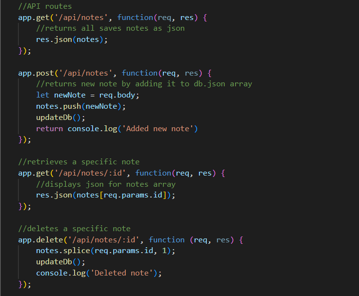
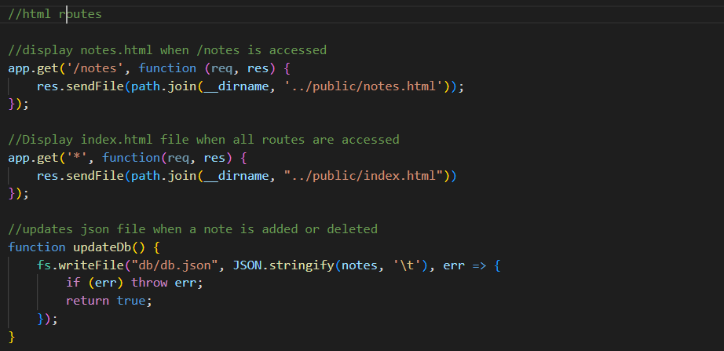
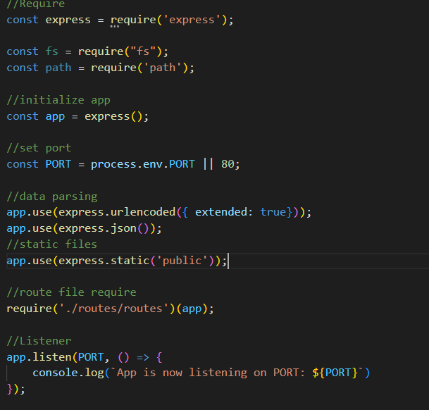

# Note Taker 

### 

## Description 
Note Taker is an application using node.js and express.js to allow users to input notes and save them locally using express.js syntax.
    
## Table of Contents 
- [Description](#description)
- [Installation](#installation)
- [Usage](#usage)
- [License](#license)
- [Contributing](#contributing)
- [Questions](#questions)

## Installation 
Note Taker requires express.js to run. First, download node package manager by running npm i in the integrated terminal. Second, install express by running npm i express. Third, require the files in index.js. 

## Usage
This project is used to demonstrate express.js backend capabilities and functionality.

## Code Snippets

## License 

    
This application is covered by the None license. 

## Contributing 
DavonHB

## Tests
No tests included.

## Questions 
Contact me, DavonHB, by email.
    
Find me on GitHub: [DavonHB](https://github.com/DavonHB)
    
Email me with any questions: davonb113@gmail.com
    

Thank you for visiting Note Taker!